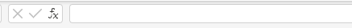

***How to run***
1. Use command **npm test**  or **npm run test-head** to run the tests (in console of your IDEA).
2. Use .env file to put real EMAIL and PASSWORD 

***Test scrtucture***
1. Test has two parts beforeEach hook and test itself. The  approauch is used to separate tests and additional staff before test.
2. Test uses page object pattern which you can find in **pageObjects** directory  with BasePage class which contains all shared action for other pages. 
3. I created fixtures for pages in order to not create them in every tests but reuse them. You can find in **fixtures** dir.
4. **util** directory contains auxiliary functions which can be used for tests
5. Created test interacts with AUT thru UI part , but I use response from specific end point to check correctness of todays date and cell coordiates(row and column) where the date is placed. Maybe it's not the best approach, but I guess that it's one of possible way. 
6. I created two approaches to put text into a sheet's cell.
The first one (_fillTextEditor_) uses the text editor field . The second one (_fillFirstSheetCell_) calculates specific coordinates to click on the first cell. The downside of the second approach is that manually moving the mouse can interrupt the method's execution, but it works faster.
7. In general, the test is quite stable. However, I have encountered a few cases where the text disappears while typing a formula or text in an text editor field. I suspect this happens because the content isn't fully loaded. To address this, I'm using **waitForResponse** to ensure that the data is loaded and the page is stable before proceeding.
8. Additionally, I created a method (_verifySheetContainsText_) that verifies if a date is present in the entire text from the sheet. But it works only when date is not masked and it requires additional Tesseract  library.

Recorded video with head mode: [View ](20240918_163006.mp4)
